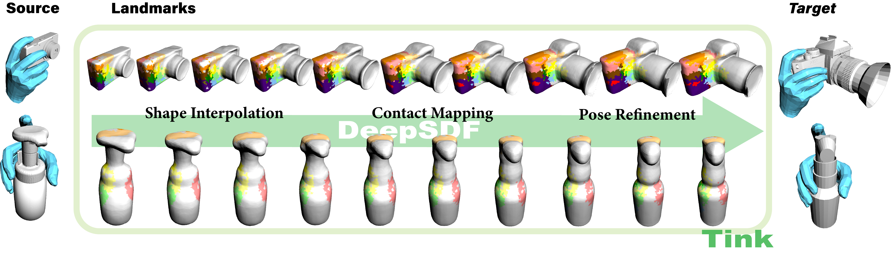
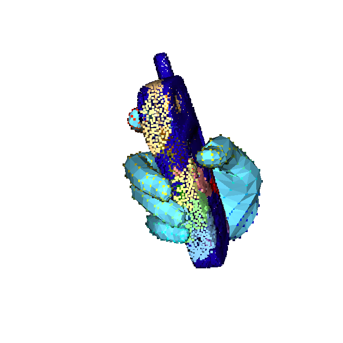

# Tink

This is the official implementation of ***Tink***.

***Tink*** is a novel method that **T**ransfers the **In**teraction **K**nowledge among objects and is one of the core contributions in [***OakInk***](https://oakink.net).



## Installation

* First, clone this repo:

  ```shell
  git clone https://github.com/KailinLi/Tink.git
  cd Tink
  git submodule init && git submodule update
  ```

* Second, to set up the environment, please follow the instructions in [***OakInk* oikit**](https://github.com/lixiny/OakInk) to install the environment with Conda (***stand-alone***).

## Download

In this repo, we provide a *mini dataset* to demonstrate the pipeline of ***Tink***.

* Download the `assets` [files](https://drive.google.com/file/d/1RFdhkxKoa1C1sRcy8c1JeQ9p2mrs0EU6/view?usp=sharing).
* Download `mano` following the official instructions. And put the `mano_v1_2` under the `assets` directory.
* Download the *mini dataset* from this [link](https://drive.google.com/file/d/166gHVftHq_whBZWBkHuHI7738hp38tUe/view?usp=sharing). And unzip them under the `DeepSDF_OakInk` directory.

Your directory should look like this:

```shell
Tink
├── assets
│   ├── anchor
    ├── hand_palm_full.txt
    ├── yodaobject_cat.json
│   └── mano_v1_2
├── DeepSDF_OakInk
│   ├── data
│   │   ├── meta
│   │   ├── OakInkObjects
│   │   ├── OakInkVirtualObjects
│   │   ├── raw_grasp
│   │   └── sdf
│   │       └── phone
```

## DeepSDF

In this section, we demonstrate how to preprocess the object meshes and train a category-level DeepSDF.

***If you are not interested in training DeepSDF, feel free to skip this section.***

### 1. Compile the C++ code

Please follow the official instructions of [DeepSDF](https://github.com/facebookresearch/DeepSDF).

You will get two executables in the `DeepSDF_OakInk/bin` directory. (We modified some of the original source code in DeepSDF, so please make sure to compile these scripts from the scratch.)

### 2. Preprocess the object meshes

```shell
export MESA_GL_VERSION_OVERRIDE=3.3
export PANGOLIN_WINDOW_URI=headless://

cd DeepSDF_OakInk
python preprocess_data.py --data_dir data/sdf/phone --threads 4
```

After finishing the script, you can find the SDF files in `DeepSDF_OakInk/data/sdf/phone/SdfSamples` directory.

### 3. Train the network

```shell
CUDA_VISIBLE_DEVICES=0 python train_deep_sdf.py -e data/sdf/phone
```

### 4. Dump the latent codes and reconstructed meshes

```shell
CUDA_VISIBLE_DEVICES=0 python reconstruct_train.py -e data/sdf/phone  --mesh_include
```

You can find the reconstructed meshes under the `DeepSDF_OakInk/data/sdf/phone/Reconstructions/Meshes`.

## Shape Interpolation

***If you skip the above section, we provide a pre-trained DeepSDF network. Please download the [files](https://drive.google.com/file/d/1g9TsQo0VPAafQPgNgDHVE3Py5XZMEh0B/view?usp=sharing), unzip them and replace the original `phone` directory:***

```shell
sdf
├── phone
│   ├── network
│   │   ├── ModelParameters
│   │   │   └── latest.pth
│   │   └── LatentCodes
│   ├── Reconstructions
│   │   ├── Codes
│   │   │   ├── C52001.pth
│   │   │   ├── ...
│   │   └── Meshes
│   │       ├── C52001.ply
│   │       ├── ...
│   ├── rescale.pkl
│   ├── SdfSamples
│   │   ├── C52001.npz
│   │   ├── ...
│   ├── SdfSamples_resize
│   ├── specs.json
│   └── split.json
```

Now, go to the `Tink` directory, and run the following script to generate the interpolations:

```shell
cd Tink

# you can generate all of the interpolations:
python tink/gen_interpolate.py --all -d ./DeepSDF_OakInk/data/sdf/phone

# or just interpolate between two objects (from C52001 to o52105):
python tink/gen_interpolate.py -d ./DeepSDF_OakInk/data/sdf/phone -s C52001 -t o52105
```

You can find the interpolations in `DeepSDF_OakInk/data/sdf/phone/interpolate` directory.

## Calculate Contact Info

We calculate the contact region of `C52001`:

```shell
python tink/cal_contact_info.py \
	-d ./DeepSDF_OakInk/data/sdf/phone \
	-s C52001 \
	--tag demo \
	-p DeepSDF_OakInk/data/raw_grasp/demo/C52001_0001_0000/2021-10-09-15-13-39/dom.pkl \
	--vis
```

The `contact_info.pkl` is stored in `DeepSDF_OakInk/data/sdf/phone/contact/C52001/demo_e54965ec08`. `e54965ec08` is the hash code of the hand parameters.



## Contact Mapping

We take the virtual object `o52105` as an example.

To transfer the contact information from `C52001` to `o52105`:

```shell
python tink/info_transform.py \
	-d ./DeepSDF_OakInk/data/sdf/phone \
	-s C52001 \
	-t o52105 \
	-p DeepSDF_OakInk/data/sdf/phone/contact/C52001/demo_e54965ec08
```

You can find the transfered contact info in `DeepSDF_OakInk/data/sdf/phone/contact/C52001/demo_e54965ec08/o52105`.

## Pose Refinement

```shell
CUDA_VISIBLE_DEVICES=0 python tink/manip_gen.py \
												-d ./DeepSDF_OakInk/data/sdf/phone \
												-s C52001 \
												-t o52105 \
												-p DeepSDF_OakInk/data/sdf/phone/contact/C52001/demo_e54965ec08 \
												--vis
```

The fitted hand pose will be stored in `DeepSDF_OakInk/data/sdf/phone/contact/C52001/demo_e54965ec08/o52105` directory.

<video src="/Users/likailin/Downloads/Tink/imgs/refine.mp4"></video>

**We also provide all the transferred hand poses of the mini dataset. You can download the [files](https://drive.google.com/file/d/1URjWi36O3vQrdN4C2NXvz53OmLILGLUf/view?usp=sharing), unzip them and replace the original `phone` directory.**

<video src="/Users/likailin/Downloads/Tink/imgs/all_refine.mp4"></video>